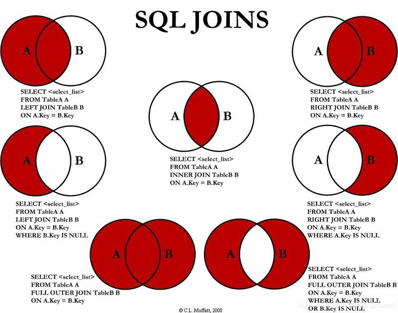

# SQL'dagi JOIN operatsiyalari haqida to'liq ma'lumot

**JOIN** operatsiyasi SQL'da ikki yoki undan ko'p jadvallarni bir-biriga (gorizontal) bog'lash va ularning ma'lumotlarini birlashtirib so'rov natijalarini olish uchun ishlatiladi. JOINlar ma'lumotlar bazasida bog'langan jadvallar o'rtasida munosabatlarni tahlil qilish va ma'lumotlarni birlashtirishda muhim ahamiyatga ega. PostgreSQL'da JOIN operatsiyalari bir nechta turlarga bo'linadi va har biri ma'lum holatlarda qo'llaniladi.

---

## JOIN turlari

SQL'da asosiy JOIN turlari quyidagilar:

1. **INNER JOIN**
2. **LEFT OUTER JOIN (yoki LEFT JOIN)**
3. **RIGHT OUTER JOIN (yoki RIGHT JOIN)**
4. **FULL OUTER JOIN (yoki FULL JOIN)**
5. **CROSS JOIN**
6. **NATURAL JOIN** (kam qo'llaniladi)
---



Quyida har bir JOIN turi haqida batafsil ma'lumot va misollar keltiriladi. Misollar uchun quyidagi ikkita jadvalni tasavvur qilamiz:

**users** jadvali:
```
| user_id | username  |
|---------|-----------|
| 1       | Ali       |
| 2       | Valijon   |
| 3       | Sitora    |
```

**orders** jadvali:
```
| order_id | user_id | amount |
|----------|---------|--------|
| 101      | 1       | 500    |
| 102      | 1       | 300    |
| 103      | 2       | 700    |
```

---

## 1. **INNER JOIN**

- **Ta'rifi**: INNER JOIN faqat ikkala jadvadda ham mos keluvchi qatorlarni qaytaradi. Agar bir jadvalda mos keluvchi qator bo'lmasa, u natijada chiqmaydi.
- **Sintaksis**:
```sql
SELECT columns
FROM table1
INNER JOIN table2
ON table1.column = table2.column;
```
- **Misol**:
```sql
SELECT users.username, orders.order_id, orders.amount
FROM users
INNER JOIN orders
ON users.user_id = orders.user_id;
```
- **Natija**:
```
| username | order_id | amount |
|----------|----------|--------|
| Ali      | 101      | 500    |
| Ali      | 102      | 300    |
| Valijon  | 103      | 700    |
```
- **Tushuntirish**: Faqat `users` va `orders` jadvallarida `user_id` bo'yicha mos keluvchi qatorlar qaytariladi. Sitora (user_id=3) uchun buyurtma yo'q, shuning uchun u natijada chiqmaydi.

---

## 2. **LEFT OUTER JOIN (LEFT JOIN)**

- **Ta'rifi**: LEFT JOIN birinchi (chap) jadvaldagi barcha qatorlarni qaytaradi va ikkinchi (o'ng) jadv aldagi mos keluvchi qatorlarni qo'shadi. Agar ikkinchi jadvalda mos qator bo'lmasa, `NULL` qiymatlari qaytariladi.
- **Sintaksis**:
```sql
SELECT columns
FROM table1
LEFT JOIN table2
ON table1.column = table2.column;
```
- **Misol**:
```sql
SELECT users.username, orders.order_id, orders.amount
FROM users
LEFT JOIN orders
ON users.user_id = orders.user_id;
```
- **Natija**:
```
| username | order_id | amount |
|----------|----------|--------|
| Ali      | 101      | 500    |
| Ali      | 102      | 300    |
| Valijon  | 103      | 700    |
| Sitora   | NULL     | NULL   |
```
- **Tushuntirish**: `users` jadvalidagi barcha foydalanuvchilar qaytariladi. Sitora uchun buyurtma yo'q, shuning uchun `order_id` va `amount` ustunlarida `NULL` chiqadi.

---

## 3. **RIGHT OUTER JOIN (RIGHT JOIN)**

- **Ta'rifi**: RIGHT JOIN ikkinchi (o'ng) jadv aldagi barcha qatorlarni qaytaradi va birinchi (chap) jadv aldagi mos keluvchi qatorlarni qo'shadi. Agar birinchi jadvalda mos qator bo'lmasa, `NULL` qiymatlari qaytariladi.
- **Sintaksis**:
```sql
SELECT columns
FROM table1
RIGHT JOIN table2
ON table1.column = table2.column;
```
- **Misol**:
```sql
SELECT users.username, orders.order_id, orders.amount
FROM users
RIGHT JOIN orders
ON users.user_id = orders.user_id;
```
- **Natija**:
```
| username | order_id | amount |
|----------|----------|--------|
| Ali      | 101      | 500    |
| Ali      | 102      | 300    |
| Valijon  | 103      | 700    |
```
- **Tushuntirish**: `orders` jadvalidagi barcha buyurtmalar qaytariladi. Agar buyurtma uchun mos foydalanuvchi bo'lmasa, `username` ustunida `NULL` chiqadi. Bu misolda bunday holat yo'q.

---

## 4. **FULL OUTER JOIN (FULL JOIN)**

- **Ta'rifi**: FULL JOIN ikkala jadvaldagi barcha qatorlarni qaytaradi. Mos keluvchi qatorlar birlashtiriladi, mos bo'lmagan qatorlar uchun `NULL` qiymatlari qaytariladi.
- **Sintaksis**:
```sql
SELECT columns
FROM table1
FULL JOIN table2
ON table1.column = table2.column;
```
- **Misol**:
```sql
SELECT users.username, orders.order_id, orders.amount
FROM users
FULL JOIN orders
ON users.user_id = orders.user_id;
```
- **Natija**:
```
| username | order_id | amount |
|----------|----------|--------|
| Ali      | 101      | 500    |
| Ali      | 102      | 300    |
| Valijon  | 103      | 700    |
| Sitora   | NULL     | NULL   |
```
- **Tushuntirish**: Ikkala jadvaldagi barcha qatorlar qaytariladi. Sitora uchun buyurtma yo'q, shuning uchun `NULL` qiymatlari chiqadi.

---

## 5. **CROSS JOIN**

- **Ta'rifi**: CROSS JOIN ikkala jadvaldagi barcha qatorlarning kartesian ko'paytmasini qaytaradi, ya'ni har bir qator ikkinchi jadv aldagi har bir qator bilan birlashtiriladi. Hech qanday shart (`ON`) talab qilinmaydi.
- **Sintaksis**:
```sql
SELECT columns
FROM table1
CROSS JOIN table2;
```
- **Misol**:
```sql
SELECT users.username, orders.order_id
FROM users
CROSS JOIN orders;
```
- **Natija**:
```
| username | order_id |
|----------|----------|
| Ali      | 101      |
| Ali      | 102      |
| Ali      | 103      |
| Valijon  | 101      |
| Valijon  | 102      |
| Valijon  | 103      |
| Sitora   | 101      |
| Sitora   | 102      |
| Sitora   | 103      |
```
- **Tushuntirish**: Har bir foydalanuvchi har bir buyurtma bilan birlashtiriladi (3 foydalanuvchi × 3 buyurtma = 9 qator). Bu JOIN turi kamdan-kam ishlatiladi.

---

## 6. **NATURAL JOIN**

- **Ta'rifi**: NATURAL JOIN avtomatik ravishda bir xil nomdagi ustunlar bo'yicha jadvallarni birlashtiradi. `ON` sharti talab qilinmaydi, lekin bu xavfli bo'lishi mumkin, chunki ustun nomlari tasodifan bir xil bo'lsa, noto'g'ri birlashmalar yuzaga keladi.
- **Sintaksis**:
```sql
SELECT columns
FROM table1
NATURAL JOIN table2;
```
- **Misol**:
```sql
SELECT username, order_id, amount
FROM users
NATURAL JOIN orders;
```
- **Natija** (agar `user_id` ustuni bir xil nomda bo'lsa):
```
| username | order_id | amount |
|----------|----------|--------|
| Ali      | 101      | 500    |
| Ali      | 102      | 300    |
| Valijon  | 103      | 700    |
```
- **Tushuntirish**: `user_id` ustuni bo'yicha avtomatik birlashadi. Ammo NATURAL JOIN kam ishlatiladi, chunki u aniq shartlarni talab qilmaydi va xatolarga olib kelishi mumkin.

---

## PostgreSQL'da JOINlarning xususiyatlari

- **MVCC (Multiversion Concurrency Control)**: PostgreSQL'da JOINlar tranzaksiyalar ichida ishlaganda, MVCC tufayli ma'lumotlarning izolyatsiyasi ta'minlanadi.
- **Optimallashtirish**: PostgreSQL so'rov optimizatori (Query Optimizer) JOIN operatsiyalarini samarali bajarish uchun eng yaxshi rejani tanlaydi. Indekslardan foydalanish JOINlarning tezligini oshiradi.
- **Ko'p jadvalli JOIN**: PostgreSQL bir nechta jadvallarni birlashtirishni qo'llab-quvvatlaydi:
```sql
SELECT users.username, orders.order_id, products.product_name
FROM users
INNER JOIN orders ON users.user_id = orders.user_id
INNER JOIN order_details ON orders.order_id = order_details.order_id
INNER JOIN products ON order_details.product_id = products.product_id;
```

---

## JOINlarni optimallashtirish bo'yicha maslahatlar

1. **Indekslardan foydalaning**: JOIN shartlarida ishlatiladigan ustunlar (masalan, `user_id`) uchun indekslar yarating.
2. **Kerakli ustunlarni tanlang**: Faqat kerakli ustunlarni so'rovga kiriting (`SELECT *` o'rniga aniq ustunlar).
3. **To'g'ri JOIN turini tanlang**: Masalan, faqat mos keluvchi qatorlar kerak bo'lsa, `INNER JOIN` ishlatiladi.
4. **Shartlarni aniq yozing**: `ON` shartida aniq va samarali shartlardan foydalaning.
5. **NATURAL JOINdan saqlaning**: U xavfli bo'lishi mumkin, o'rniga `INNER JOIN` yoki boshqa aniq JOINlardan foydalaning.

---

## JOINlar va tranzaksiyalar bilan birgalikda ishlatish

JOIN operatsiyalari ko'pincha tranzaksiyalar ichida ishlatiladi, chunki ular ma'lumotlarni o'qish yoki yangilash uchun ishlatiladi. Misol uchun, tranzaksiya ichida JOIN ishlatish:

```sql
BEGIN;
SELECT users.username, orders.order_id
FROM users
INNER JOIN orders ON users.user_id = orders.user_id
WHERE orders.amount > 500;
UPDATE orders SET amount = amount + 100 WHERE order_id = 103;
COMMIT;
```

- **Tushuntirish**: Bu tranzaksiyada `INNER JOIN` yordamida ma'lumotlar tanlanadi va keyin yangilanadi. Agar xatolik yuz bersa, `ROLLBACK` bilan o'zgarishlar bekor qilinadi.

---

## Xulosa

SQL'dagi JOIN operatsiyalari jadvallar o'rtasidagi munosabatlarni tahlil qilish va ma'lumotlarni birlashtirish uchun muhim vositadir. PostgreSQL'da quyidagi JOIN turlari qo'llab-quvvatlanadi:
- **INNER JOIN**: Faqat mos keluvchi qatorlarni qaytaradi.
- **LEFT JOIN**: Chap jadv aldagi barcha qatorlarni qaytaradi.
- **RIGHT JOIN**: O'ng jadv aldagi barcha qatorlarni qaytaradi.
- **FULL JOIN**: Ikkala jadv aldagi barcha qatorlarni qaytaradi.
- **CROSS JOIN**: Kartesian ko'paytma hosil qiladi.
- **NATURAL JOIN**: Avtomatik birlashadi, lekin kam ishlatiladi.
